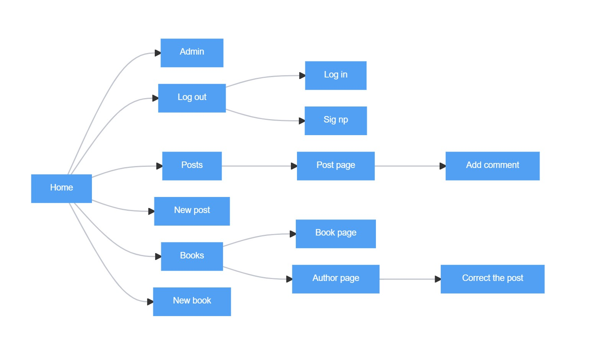

**Description of the project**
==============================

It is a web application where people can create posts about books, 
share their opinions and discuss what they have read. 

*Technologies:*
---------------
The web application is based on Django 4 and Python 3.10. 

All dependicies are in the file requirements.txt

*Pages:*
--------
The web application includes the following pages: 

#. page with all posts about books

#. detailed page of the post

#. page about the group

#. page with a list of all added books

#. detailed page of the book 

#. the author's page.

*Site map:*
-----------

*How to run the project*
------------------------

Clone project::

    git clone git@github.com:nat1905/TheBookDiplom.git

Create venv based on Python 3.10.9::

    python -m venv venv

Activate venv::

    source venv/Scripts/activate

Install depenndcies from requirements.txt::

    pip install -r requirements.txt

Make migrations::

    python manage.py makemigrations
    python manage.py migrate

Create superuser::

    python manage.py createsuperuser

Run server::

    python manage.py runserver
