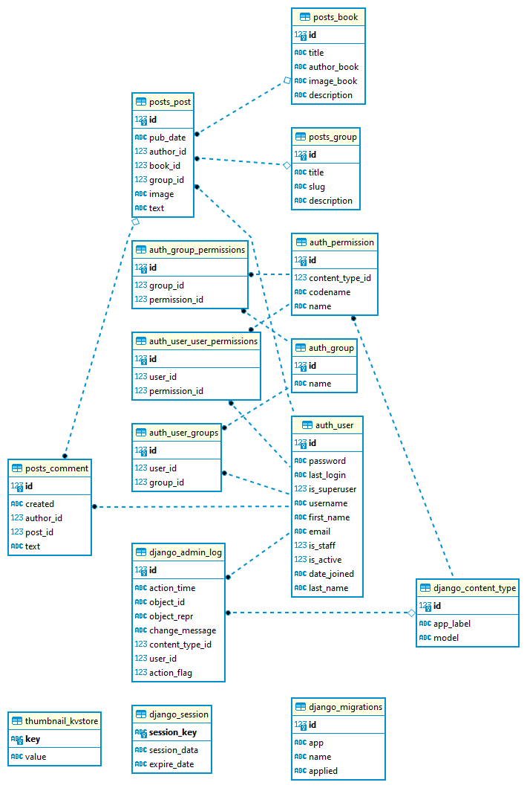

**thebook project**
===================

*Settengs of the project*
-------------------------

File settings.py comtains main configurations of the project:

#. all apps of the project are in the constatnt INSTALLED_APPS
#. templates folder: ../templates
#. database sqlite3
#. language is in the constant LANGUAGE_CODE 
#. static folder: ../static
#. media folder: ../media

*URLs of the project:*
----------------------

URLs of the project are in the file thebook/urls.py.

It includes urls of apps

*Database ER diagram*
---------------------

